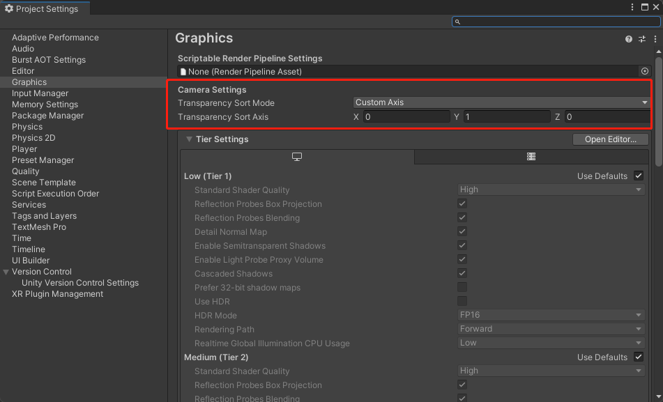

## sprite presets

* sprite的设置可以保存为preset，以便对所有sprites进行统一处理。

* Hierachy中物品的顺序会决定显示遮挡顺序。

## Transparency

* sprite->sprite sort point用于设置如何判断遮挡关系。

* 相同sorting layer时，unity默认按z轴方向来判断遮挡关系。

  通过edit->project setting->graphics->transparency sort mode&transparency sort axis 设置透视的排序方式和排序坐标轴。

  

## Components

### Sorting group

* 用于将所有子物体设置一个统一的order in layer，合并进行渲染。防止出现如player的hair和body的order in layer不一样，导致穿过其他物体时分家的情况。

## Sorting Layer

* Instance：player和所有与player交互的物体所在图层